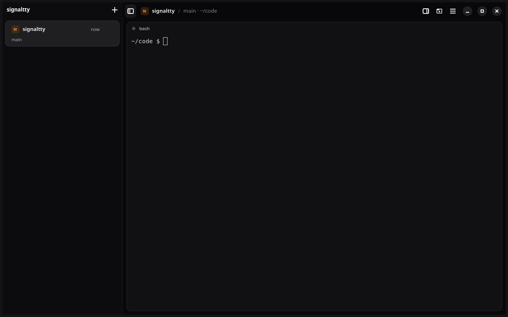

# signaltty

signaltty is a Linux workspace for coding agents. The project is early. A session server owns the terminals. The command line and the GTK window attach to that server. Closing the window leaves those terminals running.



## Build and open

You need Rust 1.92 or newer, GTK 4, libadwaita 1.7, and VTE. On Ubuntu, install `libgtk-4-dev`, `libadwaita-1-dev`, and `libvte-2.91-gtk4-dev`.

```bash
cargo build --workspace
./target/debug/signaltty daemon
./target/debug/signaltty-gui
```

`signaltty new --cwd ~/code/project` opens a shell in that directory. To start an agent there, put the program after `--`, as in `signaltty new --cwd ~/code/project -- codex`.

The design docs start at the [architecture index](docs/README.md).

The license is MIT or Apache-2.0.
